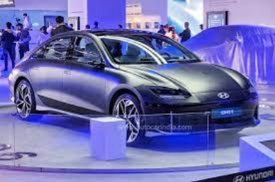

`                                        `**IUCEE ASSIGNMENT – 3**

Hyundai Motor India's vision to be a leader in the future of mobility. The company is investing heavily in electric vehicles and other new technologies, and it is committed to making mobility accessible to everyone.

Car of the Year: Hyundai TUCSON (Acer FASTER Awards 2023, TopGear Awards 2023, CAR India Awards 2023)

Best Corporate Social Responsibility Initiatives: Hyundai Motor India Foundation (Acer FASTER Awards 2023)

Premium Electric SUV of the Year: Hyundai IONIQ 5 (TopGear Awards 2023)

Executive SUV of the Year: Hyundai TUCSON (AUTOCAR Awards 2023)

Best Corporate Social Responsibility Initiative: #BeTheBetterGuy (AUTOCAR Awards 2023)

The Hyundai TUCSON has been a particularly successful vehicle for the company, winning the Car of the Year award from three different publications. The TUCSON is a midsize SUV that is praised for its design, features, and performance.

Hyundai Motor India is also committed to corporate social responsibility. The Hyundai Motor India Foundation works on a variety of initiatives, including education, healthcare, and environmental protection. The foundation's #BeTheBetterGuy campaign is a road safety campaign that aims to raise awareness of the dangers of drunk driving and speeding.

Hyundai Motor India is one of the leading automakers in India. The company's commitment to smart manufacturing and corporate social responsibility is evident in the awards that it has won in 2023.

**Car of the Year: Hyundai TUCSON Acer FASTER Award 2023**

\- The all-new Hyundai TUCSON is a design revolution that has power to transform the perception of a premium SUV. Its head-turning and striking looks create an impressive yet bold road presence. The all-new Hyundai TUCSON is crafted to meet and exceed the aspirations of new age luxury seekers and those who actively embrace the integration of most advanced global technologies, stunning modern design and enthralling performance in their lifestyles.

Epitomized to personify Revolutionary dynamism, Modern Elegance, Intelligent Technology and Future Readiness, the all-new Hyundai TUCSON has been conceptualized for achievers, who are always on the lookout for what they can do next. For this set of highfliers, the finish line is just the beginning and their ‘Next drives Now’. Through its unique facets and identity, the all-new Hyundai TUCSON is the perfect choice of mobility for customers.

\- The all-new Hyundai TUCSON will epitomize user experiences with a 26.03 cm (10.25") HD Audio Video Navigation System that reinforces the SUV’s hi-tech cabin experience while also enhancing convenience. The infotainment system offers:

.  High Definition Wide Screen

.  Split Screen display

.  Embedded Voice Commands

.  Smartphone Connectivity (Android Auto / Apple Car Play)

.  Full Touch centre fascia integrating infotainment and AC controls

.  Multi Language Support (10 Regional Languages and 2 Global Languages)

.  Home-to-Car (H2C) with Alexa in Hindi & English (1st in Segment)

.  Over-the-air updates (system and map)

.  Ambient Sounds of Nature

. Valet Mode

. User Profiles for Personalization..

**Best Corporate Social Responsibility Initiatives: Hyundai Motor India Foundation**

` `-Hyundai Motor India Foundation [HMIF] was set up in the year 2006 to carry out Corporate Social Responsibility (CSR) activities of Hyundai Motor India Limited in a sustainable manner. The projects of HMIF are aligned to the vision of progress for humanity and the three communication areas - Earth, Mobility and Hope.

` `“Dhyan-Do is an important step towards driver’s safety and well-being. The project attempts to strengthen Hyundai’s resolve towards Road-Safety and endeavors to provide a comprehensive plan towards the drivers’ well-being. Under Hyundai’s global vision ‘Progress for Humanity’ and global ‘Creating-Shared-Values’(CSV) vision of ‘CONTINUE’ and aimed to create an amicable ecosystem realizing dreams of mankind and create future role models driving social change. they are confident that this initiative will go a long way in developing a better society with empathy along with a safe driving ecosystem”.

` `- Mr. Puneet Anand, Asst. Vice President and Group Head, Corporate Affairs, Hyundai Motor India

The ‘Dhyan Do’ program entailed a two-step process, ensuring a holistic outreach to Public/Private Commercial Vehicle Drivers.

Step 1: Health check-up camps, including Mental-Health counselling for Public Transport Drivers, with a mobile health-check-up Van.

Step 2: Road safety training program and health check-up for corporate drivers.

-HMIF through ‘Mission Gurugram & Faridabad’ has reached out to over 34 000 Public/Private commercial drivers, through various touch points. This included health-check-up camps at multiple high footfall areas: Auto-Stands, Truck-stops, State & City Bus-Depots; and Road-Safety training sessions at corporate offices located in the two cities.

-‘Dhyan-Do’ thus mirrors Hyundai’s mission of going ‘Beyond Mobility’ and empowering the key-cogs in the public/private transportation domain by helping them be physically, mentally and self-awareness and productive on the job. 

